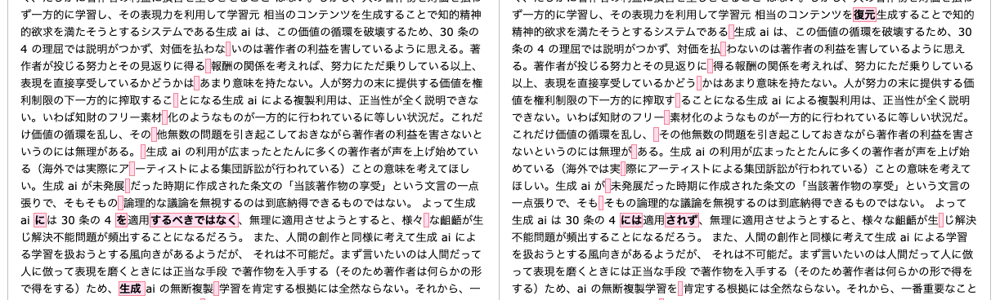

# 埋め込みベクトルと凝集クラスタリングによるパブリックコメント分析実験

文責: 西尾泰和(博士(理学)) 2025-04-28

## 概要

本実験では、文化庁が行なったパブリックコメントのデータ([nishio/aipubcom-data](https://github.com/nishio/aipubcom-data))を使用し、SentenceTransformerによる埋め込みベクトル生成と凝集クラスタリングを実施しました。目的は、現実に大量投稿が発生したパブリックコメントのデータから類似したコメントを特定し、パブリックコメントの重複や類似のパターンを分析することです。

## 実験手法

1. **データ処理**
   - aipubcom_comments.csvから「comment」カラムを抽出
   - 重複テキストを除去して一意のコメントのみを処理
   - 結果: 6,994件の総コメントから6,966件の一意のコメントを抽出

2. **埋め込みベクトル生成**
   - モデル: `sentence-transformers/paraphrase-multilingual-mpnet-base-v2`
   - 各コメントを768次元のベクトルに変換

3. **凝集クラスタリング**
   - アルゴリズム: scikit-learnのAgglomerativeClustering
   - 距離メトリック: コサイン距離
   - リンケージ: complete

## 主要な発見

### 類似内容投稿の例

**ID: 185001345000002083**

```
・好きな作家さんが生成 AI に模倣されて筆を折られたらすごく悲しくなるから嫌
・生成 AI は規制、もしくは免許制にして欲しい
・手描きと AI 絵の判別がつかずトラブルにならないか不安
```
**ID: 185001345000004465**

```
好きな作家さんが生成 AI に模倣されて筆を折られたらすごく悲しくなるから嫌
生成 AI は規制、もしくは免許制にして欲しい
手描きと AI 絵の判別がつかずトラブルにならないか心配
```

違いは記号と「不安」と「心配」という単語のみです。

"絵の判別がつかずトラブルにならないか不安"を含む投稿は62件、"絵の判別がつかずトラブルにならないか心配"を含む投稿は3件ありました。

### 非常に類似したテキストペアの存在

距離が0.001未満の非常に類似したテキストペアが複数存在することを確認しました：

#### **距離: 0.000000** - ほぼ同一のテキスト
 - 30条の4に関する長文の法的議論（ID: 185001345000004384, 185001345000004386）
 - 重複除去処理後もクラスタリングアルゴリズムが距離0のペアを検出しました。これは投稿が長文で、異なる箇所がとても少ないことに起因します。
 - 
 - 空白文字の差異はPDFからCSVにする際に改行位置に空白が入っていることに起因しています。生データを使えるなら問題ありません。今後PDFからデータを生成する場合には改行を空文字列に変換したほうがよいでしょう。
 - おそらく同一人物が提出後に推敲してもう一度提出したものと思われます。

#### **距離: 0.011628** - 句読点や漢字ひらがなのみの違い

**ID: 185001345000002167**
```
生成 AI は規制、もしくは免許制にして欲しい
```

**ID: 185001345000002805**
```
生成 AI は規制もしくは免許制にしてほしい。
```
("ほしい"になっている)

なお"生成 AI は規制、もしくは免許制にして欲しい"を含む投稿は72件ありました。"生成 AI は規制もしくは免許制にしてほしい"は1件でした。おそらくこの文言を書いて投稿するようにと宣伝したSNS投稿などがあり、それを見て投稿した人の中にコピーペーストではなく自分で入力したため漢字変換で差のでた人がいると推測されます。

---

詳細な分析結果はculster_merges.mdに出力されています。
これは凝集クラスタリングによって距離の近い順に併合される過程の冒頭50件を出力したものです。

分析結果から、現実のパブリックコメントから以下のパターンが観察されました：
- 完全に同一のコメントの重複投稿
- 句読点や単語のわずかな違いのみの類似投稿
- 同じ内容を少し修正して再投稿したケース

API費用のかからないローカルのembeddingモデルと、凝集クラスタリングの組み合わせによって、これら文字列の完全一致では判定できないような"揺れのある類似投稿"を発見することができることが確認されました。

## Future work

特に投稿が長文である場合に2つをそのまま並べて表示するのではなく、diffをとって共通部分のパーセンテージや、異なっている部分のハイライト表示をしたほうが良い。

2件以上のクラスターとの併合の場合にクラスタIDで表示されているが。比較対象を見つけるために一手間必要になる。クラスタ内の最も遠いデータとの比較を表示するのが良い。

複数のテンプレートを貼り合わせて投稿しているなどで「投稿の一部に長い範囲で共通文字列があるが投稿全体のembeddingは近くない」ケースがある。最長共通部分文字列をまず抽出して括り出してしまうなどの方法が有用かもしれない。

この手法は計算量のオーダーが大きいため1万件程度ならば現実的だが、10万件のデータに対しては現実的でない可能性が高い。ランダムサンプリングもしくは時系列カットで1万件選んでこの処理をし、大規模に実行された投稿キャンペーン由来の投稿の特徴を特定してから別途その投稿に類似したものを10万件からまとめるアプローチが良いかもしれない。


## 技術的詳細

- 使用ライブラリ: sentence-transformers, scikit-learn, numpy, pandas, scipy
- 実行環境: Python 3.12
- 処理時間: 約8分（埋め込みベクトル生成とクラスタリング）

### linkage="complete"
- 完全連結（Complete Linkage）凝集クラスタリング
- 定義: 2クラスタ間の距離 を「最も遠いペア」の距離で測る
- 直感的解説: クラスタの直径（最大内部距離） を小さく保つようマージを選ぶ。遠く離れた点が同じクラスタに入らないよう抑制する
- 生成されるクラスタは比較的球状で均質になる
- ユーザが指定する閾値(=類似度)に基づいて、クラスタ内の点が互いに一定以上の類似度であることを保証できる

## 参考

- [kouchou-ai/experimental/embvec_reduce_public_comment/](https://github.com/nishio/kouchou-ai/tree/main/experimental/embvec_reduce_public_comment): 参考にした実装
- 謝辞: 中山心太(tokoroten)氏による"SentenceTransformerによる埋め込みベクトル生成"実装を活用しています。
- この研究は[デジタル民主主義2030](https://dd2030.org/)プロジェクトにおける議論から生まれました。興味がある方はぜひSlackにご参加ください。
